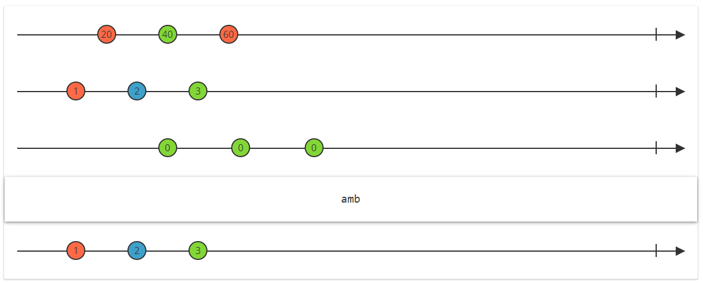

# amb







<rx-marbles key="amb"></rx-marbles>


`Rx.Observable.amb(...args)`
<a href="#rxobservableambargs">#</a> [&#x24C8;](https://github.com/Reactive-Extensions/RxJS/blob/master/src/core/linq/observable/amb.js "View in source")

Propagates the observable sequence or Promise that reacts first.

#### Arguments
1. `args` *(Array|arguments)*: Observable sources or Promises competing to react first either as an array or arguments.

#### Returns
*(`Observable`)*: An observable sequence that surfaces any of the given sequences, whichever reacted first.

#### Example

##### Using Observable sequences



```js
/* Using Observable sequences */
var source = Rx.Observable.amb(
    Rx.Observable.timer(500).select(() => 'foo'),
    Rx.Observable.timer(200).select(() => 'bar')
);

var subscription = source.subscribe(
  x => console.log(`onNext: ${x}`),
  e => console.log(`onError: ${e}`),
  () => console.log('onCompleted'));

// => onNext: bar
// => onCompleted 
```



[](http://jsbin.com/vanaci/2/embed?js,console)



##### Using Promises and Observables



```js
/* Using Promises and Observables */
var source = Rx.Observable.amb(
    RSVP.Promise.resolve('foo'),
    Rx.Observable.timer(200).select(() => 'bar')
);

var subscription = source.subscribe(
  x => console.log(`onNext: ${x}`),
  e => console.log(`onError: ${e}`),
  () => console.log('onCompleted'));

// => onNext: foo
// => onCompleted
```



[](http://jsbin.com/bukag/2/embed?js,console)



### Location

File:
- [`/src/core/observable/amb.js`](https://github.com/Reactive-Extensions/RxJS/blob/master/src/core/linq/observable/amb.js)

Dist:
- [`rx.js`](https://github.com/Reactive-Extensions/RxJS/blob/master/rx.js)
- [`rx.compat.js`](https://github.com/Reactive-Extensions/RxJS/blob/master/rx.compat.js)

Prerequisites:
- None

NPM Packages:
- [`rx`](https://www.npmjs.org/package/rx)

NuGet Packages:
- [`RxJS-Main`](http://www.nuget.org/packages/RxJS-Main/)

Unit Tests:
- [`/tests/observable/ambproto.js`](https://github.com/Reactive-Extensions/RxJS/blob/master/tests/observable/ambproto.js)
